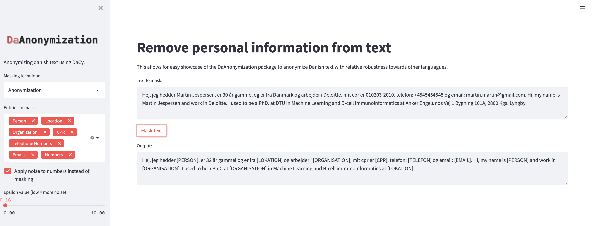

==================================
Anonymization tool for Danish text
==================================

.. image:: https://img.shields.io/pypi/v/DaAnonymization.svg
        :target: https://pypi.python.org/pypi/DaAnonymization

Description
-----------
A simple pipeline wrapped around SpaCy and DaCy for anonymizing danish corpora. The pipeline allows for custom functions to be implemented and piped in combination with custom functions.

The **DaCy model** is built on **multilingual RoBERTa** which enables **cross-lingual transfer** for other languagues ultimately providing a robust named entity recognition model for anonymization that is able to handle noisy Danish text data which could include other languages.

Languages used in the multilingual RoBERTa can be found in appendix A of XLM-RoBERTa paper: `Unsupervised Cross lingual Representation Learning at Scale <https://arxiv.org/pdf/1911.02116.pdf>`_

* Free software: Apache-2.0 license

**Disclaimer:** As the pipeline utilizes predictive models and regex function to identify entities, there is no guarantee that all sensitive information have been remove.

Features
--------

- Regex for  CPRs, telephone numbers, emails
- Integration of custom functions as part of the pipeline
- Named Entity Models for Danish language implemented (PER, LOC, ORG, MISC):
    - DaCy: https://github.com/KennethEnevoldsen/DaCy
    - Default entities to mask: PER, LOC and ORG (MISC can be specified but covers many different entitites)
    - Batch mode and multiprocessing
    - DaCy is robust to language changes as it is fine tuned from a **multilingual RoBERTa model**
- Allow anonymizing using suppression
- Allow masking to be aware of prior knowledge about individuals occuring in the texts
- Pseudonymization module (Person 1, Person 2 etc.)
- Logging to masked_corpus function, enabling tracking of warning if no person was found in a text
- Beta version: Masking or noising with laplace epsilon noise of numbers

Installation
------------
**Install from pip**

.. code-block:: bash

    pip install DaAnonymization

**Install from source**

.. code-block:: bash

    pip install git+https://github.com/martincjespersen/DaAnonymization.git

Quickstart
----------
DaAnonymization's two main components are:

- TextAnonymizer
- TextPseudonymizer

Both components uses their ``mask_corpus`` function to anonymize/pseudonymize text by removing person, location, organization, email, telephone number and CPR. The order of these masking methods are by default CPR, telephone number, email and NER (PER,LOC,ORG) as NER will identify names in the emails. The following example shows an example of applying default anonymization and how it also **cross-lingual transfer to english**.

.. code-block:: python

    from textprivacy import TextAnonymizer

    # list of texts (example with cross-lingual transfer to english)
    corpus = [
        "Hej, jeg hedder Martin Jespersen og er fra Danmark og arbejder i "
        "Deloitte, mit cpr er 010203-2010, telefon: +4545454545 "
        "og email: martin.martin@gmail.com",
        "Hi, my name is Martin Jespersen and work in Deloitte. "
        "I used to be a PhD. at DTU in Machine Learning and B-cell immunoinformatics "
        "at Anker Engelunds Vej 1 Bygning 101A, 2800 Kgs. Lyngby.",
    ]

    Anonymizer = TextAnonymizer(corpus)

    # Anonymize person, location, organization, emails, CPR and telephone numbers
    anonymized_corpus = Anonymizer.mask_corpus()

    for text in anonymized_corpus:
        print(text)

Running this script outputs the following:

.. code-block:: console

    Hej, jeg hedder [PERSON] og er fra [LOKATION] og arbejder i [ORGANISATION], mit cpr er [CPR],
    telefon: [TELEFON] og email: [EMAIL]

    Hi, my name is [PERSON] and work in [ORGANISATION]. I used to be a PhD. at [ORGANISATION]
    in Machine Learning and B-cell immunoinformatics at [LOKATION].

Using custom masking functions
------------------------------
As each project can have specific needs, DaAnonymization supports adding custom functions to the pipeline for masking additional features which are not implemented by default.

.. code-block:: python

    from textprivacy import TextAnonymizer
    import re

    # Takes string as input and returns a set of all occurences
    example_custom_function = lambda x: set(list(re.findall(r"\d+ år", x)))

    # list of texts
    corpus = [
        "Hej, jeg hedder Martin Jespersen, er 20 år, er fra Danmark og arbejder i "
        "Deloitte, mit cpr er 010203-2010, telefon: +4545454545 "
        "og email: martin.martin@gmail.com",
    ]

    Anonymizer = TextAnonymizer(corpus)

    # update the mapping to include new custom function entity finder and replacement placeholder
    Anonymizer.mapping.update({"ALDER": "[ALDER]"})

    # add the name to masking_order in the desired order
    # add custom function to custom_functions to update pool of possible masking functions
    anonymized_corpus = Anonymizer.mask_corpus(
        masking_order=["CPR", "TELEFON", "EMAIL", "NER", "ALDER"],
        custom_functions={"ALDER": example_custom_function},
    )

    for text in anonymized_corpus:
        print(text)

.. code-block:: console

    Hej, jeg hedder [PERSON], er [ALDER], er fra [LOKATION] og arbejder i [ORGANISATION],
    mit cpr er [CPR], telefon: [TELEFON] og email: [EMAIL]

Pseudonymization with prior knowledge
-------------------------------------
Sometimes it can be useful to maintain some context regarding sensitive information within the text. Pseudonymization allows for maintaining the connection between entities while masking them. Essentially this means adding a unique identifier for each individual and their information in the text.

By using the **optional** input argument ``individuals``, you can add prior information about known individuals in the text you want to mask. The structure of individuals needs to be as shown below. The first dictionary provides a key for index of the text in the corpus, the next the unique identifier (integer) of the individuals and finally a dictionary of entities known prior for each individual.

.. code-block:: python

    from textprivacy import TextPseudonymizer

    # prior information about the text
    individuals = {1:
                    {1:
                        {'PER': set(['Martin Jespersen', 'Martin', 'Jespersen, Martin']),
                         'CPR': set(['010203-2010']),
                         'EMAIL': set(['martin.martin@gmail.com']),
                         'LOC': set(['Danmark']),
                         'ORG': set(['Deloitte'])
                         },
                    2:
                        {'PER': set(['Kristina']),
                         'ORG': set(['Novo Nordisk'])
                         }
                     }

                  }

    # list of texts
    corpus = [
        "Første tekst om intet, blot Martin",
        "Hej, jeg hedder Martin Jespersen og er fra Danmark og arbejder i "
        "Deloitte, mit cpr er 010203-2010, telefon: +4545454545 "
        "og email: martin.martin@gmail.com. Martin er en 20 årig mand. "
        "Kristina er en person som arbejder i Novo Nordisk. "
        "Frank er en mand som bor i Danmark og arbejder i Netto",
    ]

    Pseudonymizer = TextPseudonymizer(corpus, individuals=individuals)

    # Pseudonymize person, location, organization, emails, CPR and telephone numbers
    pseudonymized_corpus = Pseudonymizer.mask_corpus()

    for text in pseudonymized_corpus:
        print(text)

.. code-block:: console

    Første tekst om intet, blot Person 1

    Hej, jeg hedder Person 1 og er fra Lokation 1 og arbejder i Organisation 1, mit cpr er CPR 1,
    telefon: Telefon 5 og email: Email 1. Person 1 er en 20 årig mand. Person 2 er en person som
    arbejder i Organisation 2. Person 3 er en mand som bor i Lokation 1 og arbejder i Organisation 4

Demo using streamlit
-------------------------------------
DaAnonymization is now available with an easy demo website created in streamlit.

.. code-block:: bash

    pip install streamlit==1.2.0
    streamlit run app.py

Running the code above will result in a website demoing the use of DaAnonymization.

Fairness evaluations
--------------------
Evaluations on gender and error biases are conducted in DaCy documentation.

Next up
--------

* When SpaCy fixed multiprocessing in nlp.pipe, remove current hack
